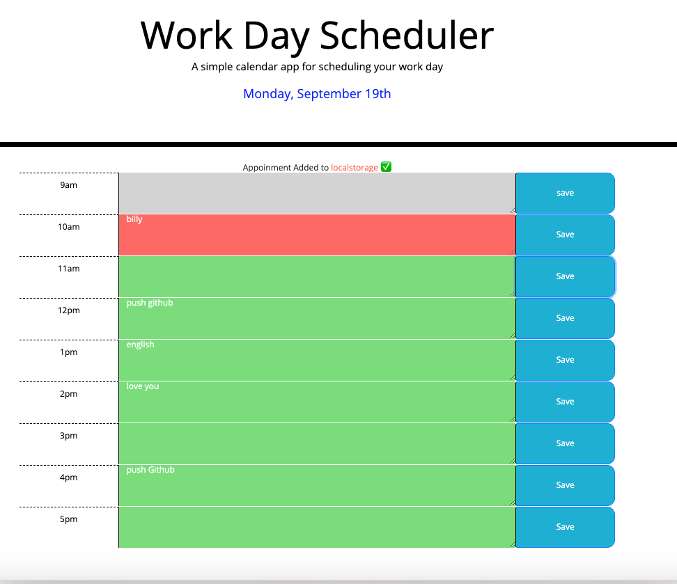

# Work Day Scheduler 

This is the work day scheduler app web link: https://xiaojing168jmg168.github.io/work-day-scheduler/

Description:

This Work Day Scheduler was created to assist a user to add important events to a daily planner, which, in turn, helps the user manage their time effectively.

When the user open this planner, the cuurent day is displayed at the top of the calendar.

As the user scrolls down, the planner layout has time blocks for standard business hours.

When the user views the time blocks for that day, each time block is color-coded to indicate whether it is in the past, present, or future: gray for past, pink for current, green for future.

Where the users clicks on a specific time blcok, the planner app allows the user to enter an event.

When the user clicks the "save" button for that specific time block, then the text for that event will be saved in local storage.

When the user refreshs the page, the saved events persist.

